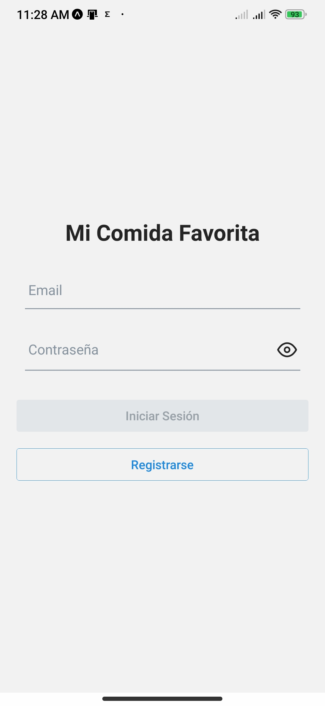
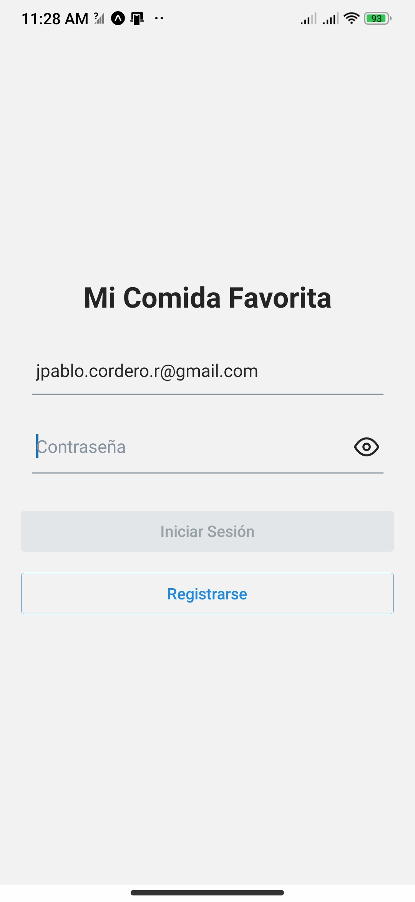
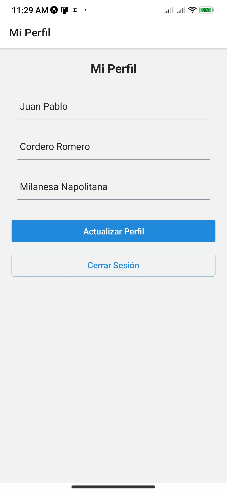
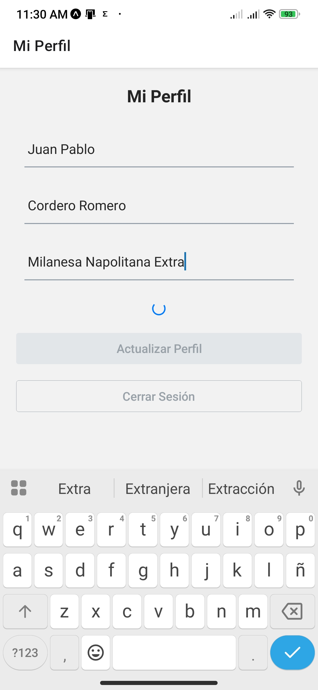
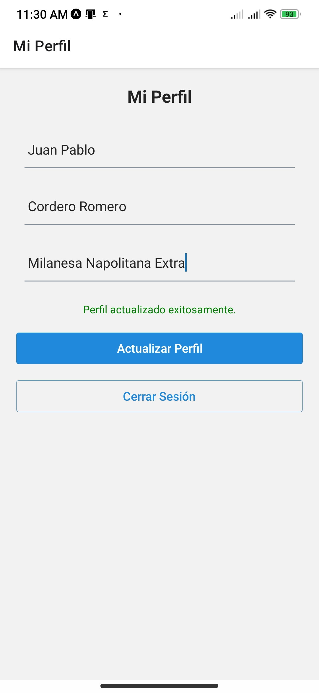
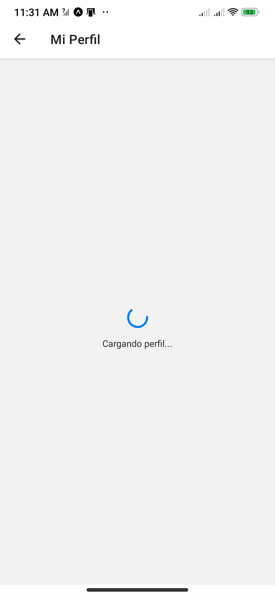
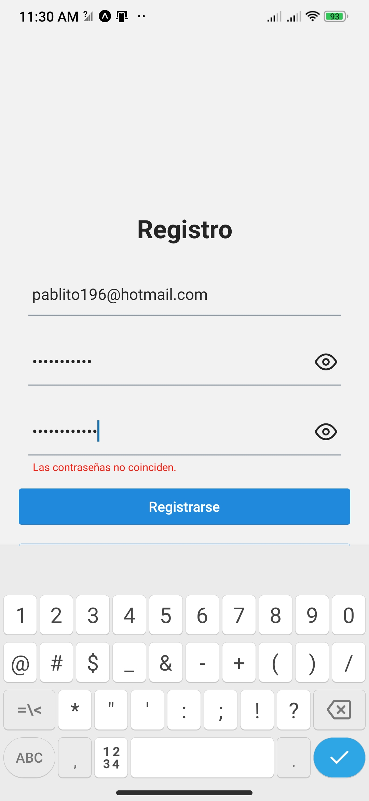

# Mi Comida Favorita

Este proyecto es un componente React Native que permite visualizar y actualizar el perfil de usuario utilizando Firebase Authentication y Firestore.

---

## Características principales

- Carga y muestra los datos del perfil desde Firestore.
- Actualiza los datos del perfil (nombre, apellido, comida favorita).
- Indicador de carga mientras se realizan operaciones.
- Manejo de errores con feedback visual mediante alertas.
- Botones deshabilitados durante procesos para evitar acciones repetidas.
- Cierre de sesión con Firebase Auth.

---

## Requisitos

- Node.js instalado.
- Expo CLI instalado globalmente (`npm install -g expo-cli`).
- Cuenta Firebase configurada con Authentication y Firestore habilitados.
- Proyecto React Native creado con Expo.

---

## Instalación y configuración

1. Clonar este repositorio o copiar el código en tu proyecto Expo.

2. Instalar dependencias:  (`npm install`)

## Mejoras implementadas

1. Indicador de carga: Spinner visible durante la carga y actualización del perfil.

2. Manejo de errores: Alertas para notificar problemas en carga, actualización o cierre de sesión.

3. Deshabilitar botones: Botones de actualización y cierre de sesión deshabilitados durante las operaciones para evitar múltiples acciones simultáneas.

## Screenshots

### Login

### Boton deshabilitado en login

### Perfil de usuario

### Perfil actualizado

### Mensaje de actualizacion de perfil

### Spinner cargando perfil

### Validaciones en el registro

